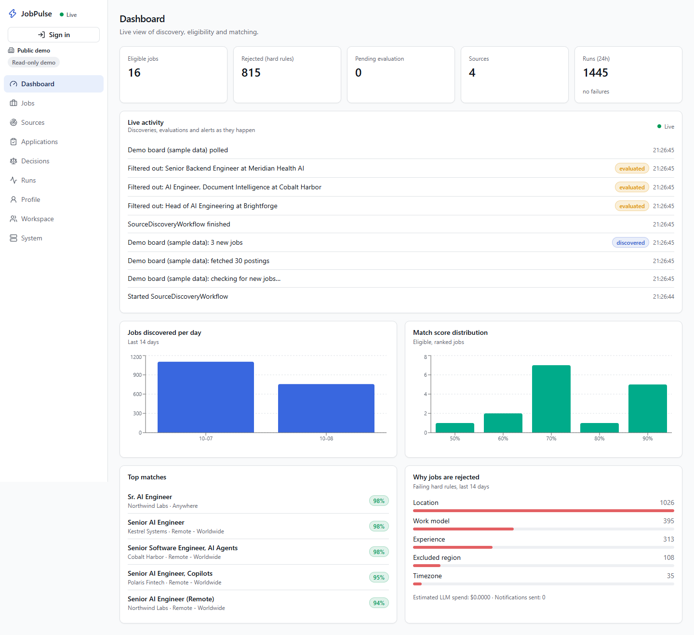
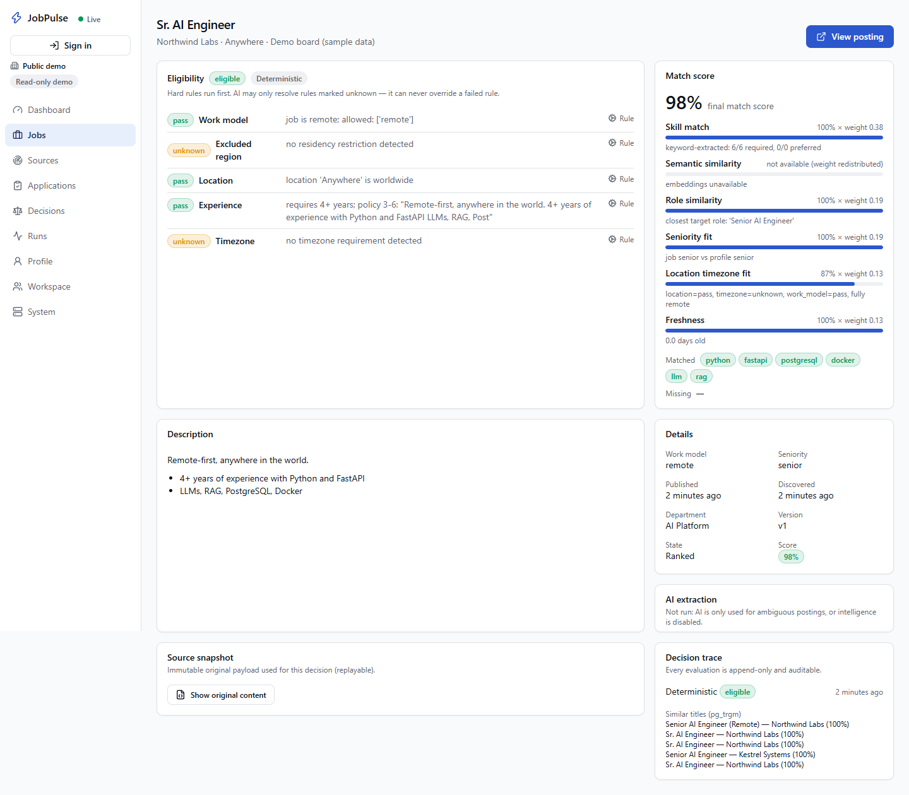
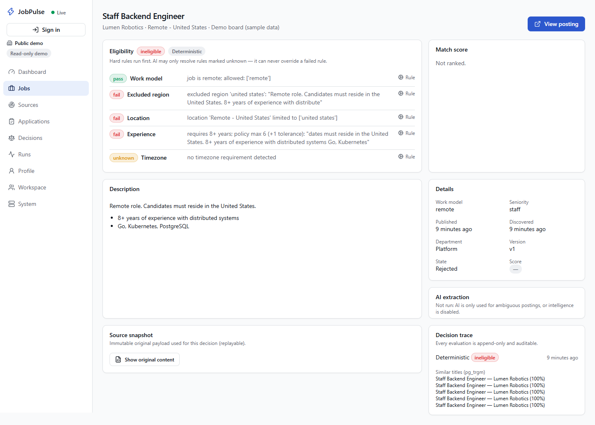

# JobPulse

## Why I built it

While applying for remote roles from India, I kept reopening separate company career pages
and repeating the same five checks for every promising post: work model, residency,
location, experience and time-zone overlap. For scale, manually sweeping roughly 12 boards
and checking each promising role takes about 40 minutes; generic alerts still surfaced
US-only roles, did not explain why something matched, and could deliver a useful opening
days late. I built JobPulse to do that repetitive monitoring continuously while keeping the
final decision inspectable.

JobPulse is an event-driven job opportunity radar. It discovers jobs from ATS boards and
feeds, applies **deterministic hard-eligibility rules**, uses an LLM **only for ambiguous
facts**, ranks matches with an **explainable** score, and notifies the user — with every
decision auditable and replayable.

## See the system, not just the source



| Explainable eligible decision | Deterministic failure |
|---|---|
| Every rule stores its outcome and quoted evidence; the final score remains decomposable. | A US-only, 8+ years role fails hard rules, skips ranking and cannot be rescued by AI. |
|  |  |

These are unedited captures from the seeded local demo. The companies and postings marked
`demo` are synthetic and use reserved `.example` domains; the pipeline and UI are the same
ones exercised by the integration and browser tests.

```
Sources (Greenhouse · Lever · Ashby · RSS · JSON · HTML)
   │  SourcePollingWorkflow (adaptive interval, backoff, circuit breaker)
   ▼
SourceDiscoveryWorkflow: Fetch → Normalize → Store (3-layer dedup, versions, R2 snapshots)
   │  one child per new/changed job
   ▼
JobEvaluationWorkflow: Eligibility → Enrichment → Embedding → Ranking → Notification
   │
   ▼
PostgreSQL 18 (pgvector · pg_trgm · FTS)  ──►  FastAPI  ──►  Next.js dashboard
   │ pg_notify (in the same transaction)        ▲ SSE: live feed, toasts, cache invalidation
   └──────────────► LISTEN ─► EventHub ─────────┘
Redis: shared rate limits · idempotency keys · response cache (ephemeral, fail-safe)
```

## Scope and sequencing

The submission's core problem is the personal job-search loop: discover a posting, decide
whether it is actually applicable, explain the score, and notify once. That vertical slice
was built first and is the focus of the [10-minute demo](docs/demo.md).

Multi-tenant workspaces, row-level security, extra sign-in providers, plan limits and
Razorpay are a clearly separated **Phase 2 product extension**. They prove how the same core
could be shared safely, but they are not required to justify the original problem and are
not part of the primary Damco walkthrough. Online payments and hosted production are not
claimed as live.

## Known limitations / what's broken

- **No hosted demo yet.** Deployment manifests exist, but this repository has only been
  exercised locally. Reviewers currently need `make demo`; see [Production deploy](#production-deploy-phase-2-opt-in).
- **External providers are not live-verified.** OpenAI, Resend, Razorpay, Google and Microsoft
  paths have automated or mocked coverage, but need real credentials and provider-side
  configuration. Without OpenAI, evaluation deliberately continues in deterministic-only
  mode and leaves unresolved facts marked for review.
- **Closure detection assumes a full listing.** A feed that returns only recent items can
  make an older open job appear closed. Those sources need a future incremental-feed mode;
  today they should use a long interval and must not be treated as authoritative for closure.
- **Redis degradation is weaker across replicas.** Reads continue with per-instance in-memory
  rate limits and no shared cache when Redis is unavailable; the first requests can also pay
  connection timeout cost before the circuit opens. Idempotent writes fail closed with 503
  rather than risk a duplicate.
- **The UI exposes one primary candidate profile per workspace.** The data model and worker
  support multiple profiles, but the profile switcher and management UI are not built.
- **The bundled Demo board is synthetic.** It makes the pipeline observable on demand; it is
  not evidence of production traffic, user adoption or live-provider reliability.

The full operational failure matrix is in [failure-modes.md](docs/failure-modes.md), and
design compromises are in [tradeoffs.md](docs/tradeoffs.md).

## What is in the box

| Area | Implementation |
|---|---|
| Domain core | `packages/python` — pure, framework-free: adapters, normalizer, eligibility engine, ranking, OpenAI client, notifications, polling policy |
| API | `apps/api` — FastAPI, SQLAlchemy 2 async + psycopg 3, Alembic, structlog, Prometheus, OTel, Sentry |
| Worker | `apps/worker` — Temporal workflows/activities, continue-as-new polling loops |
| Web | `apps/web` — Next.js 16, React 19, Tailwind 4, shadcn-style UI, TanStack Query/Table v9, Zustand, RHF + Zod, Recharts, Auth.js |
| Data | PostgreSQL 18: UUIDv7 keys, pgvector HNSW, `pg_trgm` GIN, generated `tsvector` + GIN |
| Realtime | Commit-coupled `pg_notify` → one LISTEN connection per API process → Server-Sent Events; live feed, match toasts, per-source sync status; polling only as fallback |
| Production hardening | Redis sliding-window rate limits (per owner / visitor / IP, tiered reads·writes·streams, `RateLimit-*` headers), Stripe-style `Idempotency-Key`, short-TTL response cache, circuit breaker, request timeouts, gzip, deny-by-default CORS |
| Phase 2 extension | Workspaces, PostgreSQL RLS, memberships, GitHub/Google/Microsoft/email sign-in, plan limits, Razorpay adapter, export/deletion |
| Ops | Docker multi-stage (non-root, read-only), Compose, GitHub Actions CI; unverified deployment configuration for Render + Vercel + Neon + Temporal Cloud + R2 |

## Quick start (local)

Requirements: Docker, [uv](https://docs.astral.sh/uv/) ≥ 0.12, Node 24 + pnpm.

**One command** (generates missing secrets, starts everything, seeds a live demo board):

```bash
make demo        # or: uv run python scripts/demo.py
```

Then follow the [demo walkthrough](docs/demo.md). Manual setup:

```bash
cp .env.example .env            # set AUTH_SECRET (≥ 32 chars)
make keys                       # paste API_JWT_PRIVATE_JWK + API_JWT_JWKS into .env
docker compose up --build -d    # Postgres, Redis, Temporal (+UI), migrations, API, worker, web
make seed                       # demo profile + three public job boards
```

- Dashboard → http://localhost:3000 (read-only public demo unless signed in as owner)
- API docs → http://localhost:8000/docs
- Temporal UI → http://localhost:8233

**Optional write access for the seeded Default workspace (GitHub):**

1. Register a **GitHub App** (preferred over a classic OAuth App: up to 10 callback URLs, so one
   app serves local + production, and it needs **no permissions**). This link pre-fills the form -
   just pick a unique name and click *Create GitHub App*:
   [https://github.com/settings/apps/new?name=JobPulse&descripti…](https://github.com/settings/apps/new?name=JobPulse&description=Sign%20in%20with%20GitHub%20for%20JobPulse&callback_urls[]=http://localhost:3000/api/auth/callback/github&webhook_active=false&public=false)
2. On the app page copy the **Client ID**, click **Generate a new client secret**, and set
   `AUTH_GITHUB_ID` / `AUTH_GITHUB_SECRET` in `.env` (never commit or paste the secret elsewhere).
3. Set `OWNER_GITHUB_IDS=<your numeric GitHub id>` (`gh api users/<login> --jq .id`).
4. `docker compose up -d --force-recreate web`, sign in at http://localhost:3000, then open
   `/api/backend/me` - it should show `"role":"OWNER"`.

Everyone can inspect the read-only public demo without an account. `OWNER_GITHUB_IDS` is a
platform-admin bootstrap allowlist; normal workspace roles are read from PostgreSQL on every
request. Open sign-up can also use a local email link, and Google/Microsoft become available
only when their optional credentials are configured. None of those Phase 2 providers is needed
for the core demo. For production, add `https://<web-domain>/api/auth/callback/github` as an
extra callback URL in the same app's settings.

**AI enrichment** is optional. Without `OPENAI_API_KEY`, JobPulse runs in deterministic-only
mode: hard rules and keyword skill matching still work; unknown rules remain flagged for review.

## Development

```bash
make install     # uv sync + pnpm install
make check       # ruff, mypy --strict, eslint, tsc, pytest, vitest
make test        # integration tests start PostgreSQL via Testcontainers
make e2e         # Playwright against the running stack
```

Set `JOBPULSE_TEST_DATABASE_URL` to reuse an existing Postgres instead of Testcontainers.

## API

Versioned REST under `/api/v1`: `jobs`, `jobs/{id}` (full decision trace), `jobs/{id}/snapshot`,
`jobs/{id}/evaluate`, `jobs/{id}/applications`, `sources` (+ `PATCH`, `/sync`), `runs`, `profile`,
`applications`, `decisions`, `dashboard`, `system`, `me`. Probes: `/health/live`, `/health/ready`, `/metrics`.

Mutations require an authenticated workspace role appropriate to the action (member, admin or
owner). The web app mints short-lived Ed25519 tokens server-side; the API verifies them with
public keys only, verifies the selected workspace, and resolves the caller's role from workspace
membership. `OWNER_GITHUB_IDS` grants platform-admin bootstrap access; it is not the tenant
authorization model ([ADR 0006](docs/adr/0006-authentication-and-authorization.md),
[ADR 0008](docs/adr/0008-multi-tenancy-with-row-level-security.md)). Anonymous callers are
`PUBLIC_DEMO` (read-only). Errors are RFC 9457 `application/problem+json`.

## How a decision is made

1. **Deterministic eligibility** — work model, residency/exclusion, location, experience,
   timezone. Each rule yields `pass` / `fail` / `unknown` with quoted evidence.
2. **AI enrichment** (only if some rule is `unknown`) — OpenAI Responses API with a strict
   JSON schema; cheap model first, reasoning model only when confidence is low. AI may resolve
   `unknown` rules but **can never override a deterministic `fail`**.
3. **Ranking** — `0.30 skill + 0.20 semantic + 0.15 role + 0.15 seniority + 0.10 location/tz +
   0.10 freshness`; missing components are re-weighted transparently; every component is stored.
4. **Notification** — once per job content version per channel (idempotent dedupe key).

## Production deploy (Phase 2, opt-in)

`.github/workflows/deploy.yml` runs after a green CI on `main` only when the repository
variable `DEPLOY_ENABLED=true` is set. Before enabling it, provision Neon, Temporal Cloud,
Cloudflare R2, Render (`render.yaml`) and Vercel, then add the `production` environment
secrets: `DATABASE_URL`, `RENDER_API_KEY`, `RENDER_API_SERVICE_ID`,
`RENDER_WORKER_SERVICE_ID`, `VERCEL_TOKEN`, `VERCEL_ORG_ID`, `VERCEL_PROJECT_ID`, and the
variables `PRODUCTION_API_URL` / `PRODUCTION_WEB_URL` for smoke tests.

This configuration has **not** been exercised against a live production environment. Enabling
it provisions or mutates external services and is intentionally left to the repository owner.

## Documentation

- [Demo walkthrough](docs/demo.md)
- [Multi-tenancy design](docs/design/multi-tenancy.md)
- [Architecture](docs/architecture/overview.md)
- [ADRs](docs/adr/)
- [Production runbook](docs/runbook.md)
- [Security](docs/security.md)
- [Failure modes](docs/failure-modes.md)
- [Trade-offs](docs/tradeoffs.md)

## License

MIT — see [LICENSE](LICENSE).
